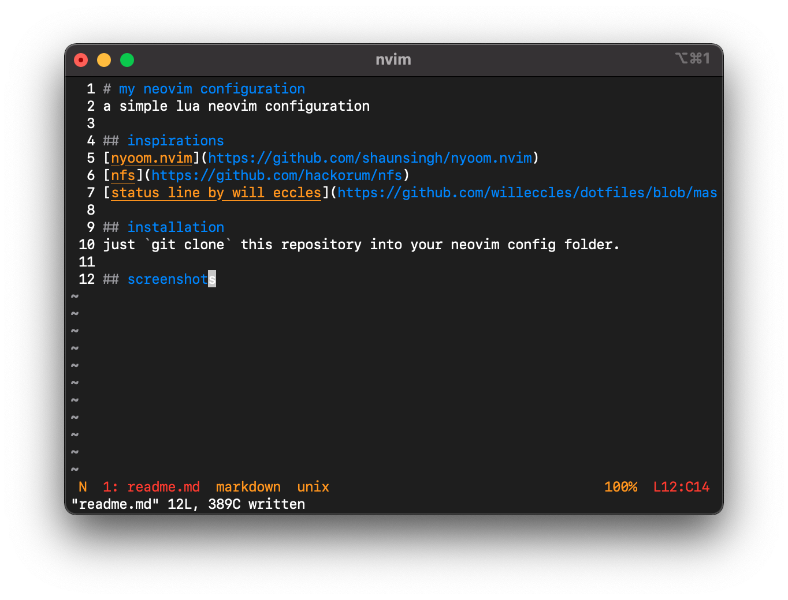

# my neovim configuration
a simple lua neovim configuration

## inspirations
[nyoom.nvim](https://github.com/shaunsingh/nyoom.nvim)
[nfs](https://github.com/hackorum/nfs)
[status line by will eccles](https://github.com/willeccles/dotfiles/blob/master/neovim/.config/nvim/lua/statusline.lua)

## installation
just `git clone` this repository into your neovim config folder.

## screenshots

